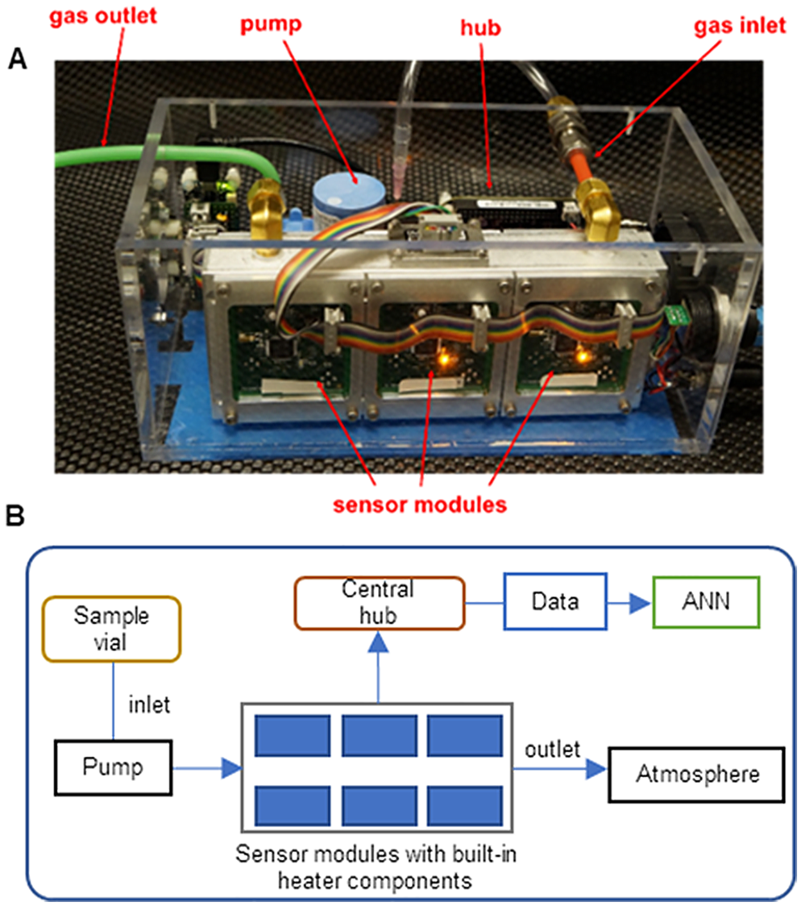

# THE BIOLOGICAL EVA™

This repository is the companion to the Medium blog "Can the Biological EVA™ (BEVA) be smelly and stable?"
https://medium.com/@Aminatta/exploratory-data-analysis-and-real-time-classification-with-the-biological-eva-eb7503906d33

This notebook gives a peek into some exploratory data analysis and model development considerations for real-time sensing data to help identify bacteria responsible for Urinary Tract Infections. It aims to answer three questions to help with these considerations:

1. Are the sensors we are using effective in distinguishing between normal human urine, infected human urine, and lab air?
 
 Using dimensionality reduction techniques such as Principal Component Analysis our variance is successfully captured and we are able to distinguish between the clusters, showing that our sensors will be able to successful distinguish between the three groups.

2. Can we build a predictive classification model that can tell the difference between data collected on one day and tested on another?

We are able to do this using XGBOOST, building a model with data collected on one day, and testing it on newly collected data on the second day. 

3. Could condensing our data to be more efficient improve our model? 

Using the condensed PCA dataset, we were able to improve the accuracy of the model with data collected on another day. 

## Files Included:

#demo_for_beva.ipynb - a Python Jupyter notebook that takes us through exploratory data analysis 

#bevafun.py - python function that helps us prepare our data matrix for PCA, plotting variance and returning the normalized dataframe.

#data folder consisting of two CSV files containing sensor measurements and labels:
"BEVA_Day1.csv" 
"BEVA_Day2.csv"

beva.PNG - image of the Biological EVA (TM) prototype.

## Libraries Used:
The following python libraries were used in this projec:

* numpy==1.20.1
* pandas==1.2.4
* matplotlib==3.3.4
* xgboost==0.80 
* seaborn==0.11.1

## Licensing, Authors and Acknowledgements
* Datasource= https://www.kaggle.com/datasets/aminatadebiyi/beva-plos-one-ann

Acknowledgements
Than, Nam, et al. "Quantitation of ethanol in UTI assay for volatile organic compound detection by electronic nose using the validated headspace GC-MS method." Plos one 17.10 (2022): e0275517.

License - Apache License 2.0

